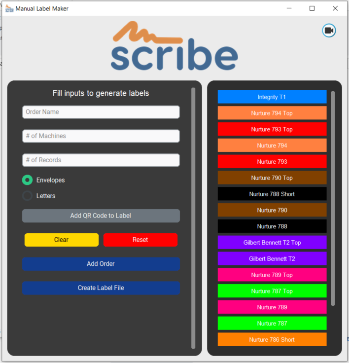

# Manual Label Maker Application

**Label Maker** is a desktop application built with Python and CustomTkinter. It allows users to generate labels with customizable colors, QR codes, and detailed configurations for orders. The application supports multiple input options, including order name, number of machines, and records, with intuitive UI components.

---

## Features

- **Add Orders**: Input order details including name, machine count, and record count.
- **Custom Colors**: Assign colors to orders for easy identification.
- **QR Code Support**: Add QR codes to each label for quick scanning.
- **PDF Label Creation**: Generate labels as PDF files in a structured format.
- **Clear and Reset Options**: Quickly clear inputs or reset all data including queued orders and displayed colors.
- **Dynamic UI Updates**: Displays dynamically created labels and maintains order history with assigned colors.
- **History Management**: Tracks the last 20 orders and their colors.

---

## Installation

1. **Clone the repository**:
   ```bash
   git clone https://github.com/yourusername/label-maker.git
   ```

2. **Navigate into the project directory**:
   ```bash
   cd label-maker
   ```

3. **Install dependencies**:
   ```bash
   pip install -r requirements.txt
   ```

---

## Usage

1. Run the application:
   ```bash
   python main.py
   ```

2. Input order details, assign colors, and create PDF labels as needed.

3. Use the **Clear** button to clear input fields or the **Reset** button to reset the entire application state.

4. Once labels are created, click **Open Created Label File** to view the PDF.

---

## Dependencies

- **Python 3.10+**
- **CustomTkinter**
- **Pillow**
- **QRCode**
- **Logging**

---

## Screenshots




---

## Contributing

Contributions are welcome!

1. Fork the repository.
2. Create a new branch (`git checkout -b feature-branch`).
3. Commit your changes (`git commit -m 'Add new feature'`).
4. Push to the branch (`git push origin feature-branch`).
5. Open a pull request.

---

## License

This project is licensed under the MIT License. See [LICENSE](LICENSE) for details.

---

## Contact

For questions or suggestions, feel free to open an issue on the repository.

---

Enjoy using the **Manual Label Maker** application!
